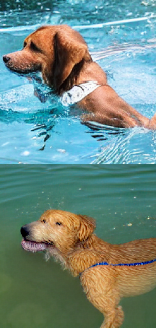

# IM-LY

An AI that generates Images and NFTs from plain text.

## About IM-LY

It harnesses the power of AI for imagining user's input.

It uses Deep Learning Tech along with Blockchain to get the best out of both worlds, AI and Web 3.0.

## Why?

Existing solutions aren't free to use or the free alternatives are too slow, can't run on potato PCs or fail to understand the context/intent of the user's prompt.

**IM-LY** being open source, is free to use, resource friendly, and generates NFTs directly from the generated images, making it something different!

### For example

**INPUT:**
> Dog swimming in water, photorealistic

### Output

